# <center>武汉大学国家网络安全学院教学实验报告</center>

|   课程名称   |  操作系统设计与实践  |   实验日期   | 2022.9.24 |
| :----------: | :------------------: | :----------: | :-------: |
| **实验名称** | **保护模式工作机理** | **实验周次** | **第2周** |
|   **姓名**   |       **学号**       |   **专业**   | **班级**  |
|    李心杨    |     202030281022     |   信息安全   |     2     |
|    王宇骥    |    2020302181008     |   信息安全   |     2     |
|    林锟扬    |    2020302181032     |   信息安全   |     2     |
|    郑炳捷    |    2020302181024     |   信息安全   |     2     |

#### 一、实验目的及实验内容
## 一、实验目的及实验内容

##### 实验目的
### 实验目的

1. 理解x86架构下的段式内存管理。
2. 掌握实模式和保护模式下段式寻址的组织方式、关键数据结构、代码组织方式。
3. 掌握实模式与保护模式的切换。
4. 掌握特权级的概念，以及不同特权之间的转移。
5. 了解调用门、任务门的基本概念。

##### 实验内容
### 实验内容

1. 认真阅读章节资料，掌握什么是保护模式，弄清关键数据结构：GDT、descriptor、selector、GDTR及其之间关系，阅读pm.inc文件中数据结构以及含义，写出对宏Descriptor的分析。
2. 调试代码，/a/ 掌握从实模式到保护模式的基本方法，画出代码流程图，如果代码/a/中，第71行有dword前缀和没有前缀，编译出来的代码有区别么，为什么，请调试截图。
3. 调试代码，/b/，掌握GDT的构造与切换，从保护模式切换回实模式方法。
4. 调试代码，/c/，掌握LDT切换。
5. 调试代码，/d/掌握一致代码段、非一致代码段、数据段的权限访问规则，掌握CPL、DPL、RPL之间关系，以及段间切换的基本方法。
6. 调试代码，/e/掌握利用调用门进行特权级变换的转移的基本方法。

#### 二、实验环境及实验步骤
## 二、实验环境及实验步骤

 ##### 实验环境
### 实验环境

Ubuntu 14.04；bochs 2.7 .

##### 概念分析
### 概念分析

- **保护模式**：相比于实模式，保护模式能够支持多任务，支持优先级，并且拥有更强大的寻址能力。

  - GDT：由多个描述符(Descriptor)组成，提供段式存储机制。
  - GDT/LDT：由多个描述符(Descriptor)组成，提供段式存储机制。
  - Descriptor：每一个Descriptor定义一个段，其结构如下：
  
  
    
  
  ​		段基址：共32位，存放在不连续的四个字节中，用于寻址。
  
  ​		段界限：共20位，表示的是段边界的扩展最值。
  
  ​		其余是相关属性位，用这些额外的属性来提高安全性。
  
  - Selector：给出描述符在GDT/LDT的索引号、GDT/LDT标志以及特权级。
  - Selector：给出描述符在GDT/LDT的索引号、GDT/LDT标志TI(Table Indicator)以及特权级RPL，当TI=0时表示段描述符在GDT中，当TI=1时表示段描述符在LDT中。
  
  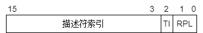
     
  
   - GDTR寄存器：保存GDT的起始地址和界限。
  
  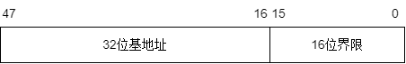
     

   - LDTR寄存器：由一个可见的16位选择子和不可见的存着描述符的基址和限长的由CPU维护的高速缓冲（会随时变化）组成。
  
- GDT寻址过程中的各个数据结构的**关系**：① 先从GDTR寄存器中获得GDT基址。② 在GDT中根据Selector确定Descriptor。③ Descriptor给出了段的基址，再根据程序中给出的偏移地址得到最终的线性地址。 ④ 访存。

  

- LDT寻址过程中的各个数据结构的**关系**：① 先从GDTR寄存器中获得GDT基址。② 从LDTR寄存器中获取LDT的索引，并在GDT中找到LDT的描述符从而得到LDT段地址。③ 从选择子中得到的描述符索引找到目标段的描述符，然后得到最终的线性地址。 ④ 访存。
  
- 寻址过程中的各个数据结构的**关系**：① 先从GDTR寄存器中获得GDT基址。② 在GDT中根据Selector确定Descriptor。③ Descriptor给出了段的基址，再根据程序中给出的偏移地址得到最终的线性地址。 ④ 访存。
  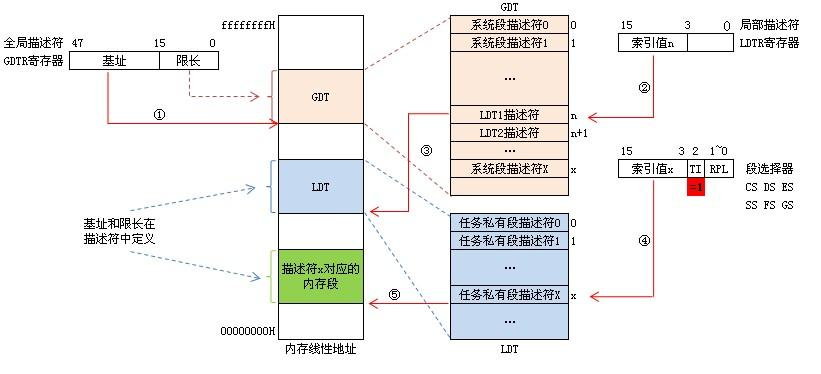

- GDT与LDT访存方式并没有本质上的区别，只是通过LDT访存要现在GDT中查找该LDT的位置，可以它们之间的关系理解为GDT是“一级描述符表”，LDT是“二级描述符表”。


  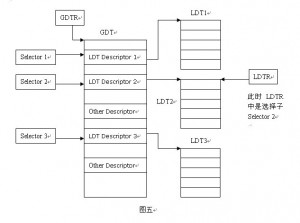

##### 代码/a/：从实模式到保护模式
### 代码/a/：从实模式到保护模式

- 代码流程图

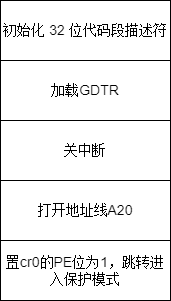
  

- 运行源码程序

  这里我们采用DOS执行COM文件的方法来运行程序。

  - 按照参考书教程，准备freedos.img和pm.img，并修改bochsrc。

  - 编译pmtest1.asm，并将pmtest1.com复制到虚拟软盘pm.img上。

    ```
    nasm pmtest1.asm -o pmtest1.com
    sudo mount -o loop pm.img /mnt/floppy
    sudo cp pmtest1.com /mnt/floppy
    sudo umount /mnt/floppy
    ```

  - 在FreeDos中运行程序。

  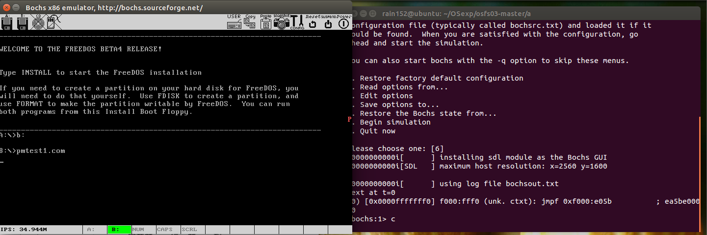
    

  ​	可以看到在bochs窗口右侧中出现红色的P，说明程序正确运行。

- 关键步骤解释

  - 加载GDTR：前文中已经给出了GDTR的结构，高4字节是GDT基地址，低2字节是GDT的界限。为了加载GDTR，需要首先设置好这6字节的内容。然后利用lgdt指令完成加载即可。

    相关代码如下。

  ```
  ; 为加载 GDTR 作准备
  	xor	eax, eax
  	mov	ax, ds
  	shl	eax, 4
  	add	eax, LABEL_GDT		; eax <- gdt 基地址
  	mov	dword [GdtPtr + 2], eax	; [GdtPtr + 2] <- gdt 基地址
  
  	; 加载 GDTR
  	lgdt	[GdtPtr]
  ```

  - 关中断&打开地址线A20

    保护模式和实模式的中断处理机制不同，所以在切换时需要进行关中断操作。另外，保护模式有更强的访问内存的能力，这要求将A20打开以访问全部的内存。
    保护模式和实模式的中断处理机制不同，所以在切换时需要进行关中断操作以避免引起错误。另外，保护模式有更强的访问内存的能力，这要求将A20打开以访问全部的内存。

    相关代码如下。
    - 打开A20地址线的原因：在8086和8088中，16位段地址+16位偏移地址能够表示的最大地址为FFFF:FFFF即0x10FFEF，但由于20根地址线最大只能表示0xFFFFF，所以采用了一种被称为wrap-around的技术来处理：当表示的地址大于0xFFFFF时，对其进行求模运算，使其从0重新开始，例如FFFF:0010实际表示的地址为0x0。但是80286的地址总线为24根（它仍然是16位），可以访问0x100000及以上的地址，Intel为了兼容8086和8088的特性，将这第21根地址线A20设为可被软件控制的，当A20关闭时，80286保留上述求模运算（地址第20位永远为0），开启时则可以访问0x100000及以上的地址（可以改地址第20位的值为1），这根地址线的开关也在以后的更新换代中被保留了下来。在本实验中，打开A20可以保证保护模式下内存地址连续。
  
  
    <br/>相关代码如下。

    ```
    ; 关中断
    	cli
    
    ; 打开地址线A20
    in	al, 92h
    or	al, 00000010b
    out	92h, al
    ```

  - 切换到保护模式

    cr0寄存器的第0位是PE位，将该位置为1，CPU就能够运行于保护模式了。

    相关代码如下。

    ```
    ; 准备切换到保护模式
    mov	eax, cr0
    or	eax, 1
    mov	cr0, eax
    ```

- 程序修改

  将源代码中jmp dword SelectorCode32:0一句中的dword删除，重新编译并运行。结果发现程序仍然能够正常运行，窗口中仍然能够显示p。

  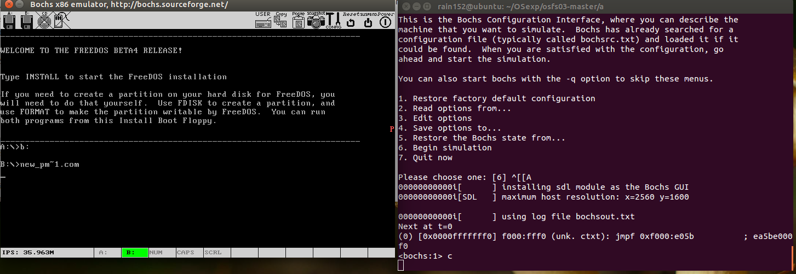

  对源程序和修改程序的对应二进制文件进行反汇编，对比如下。

  
  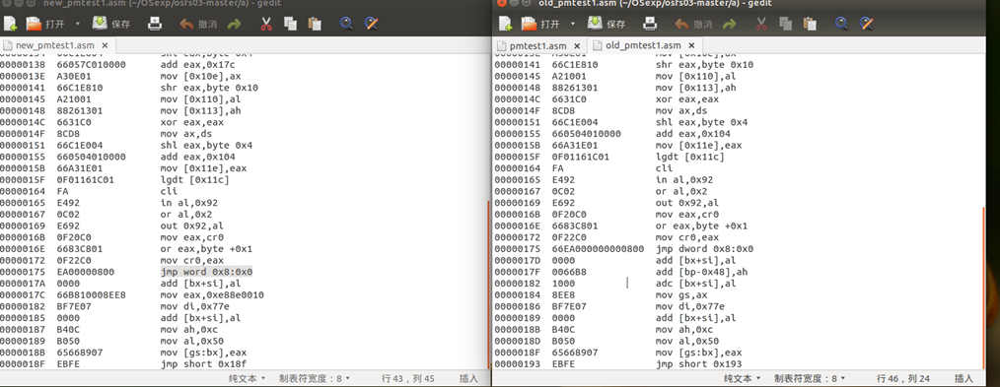

​		不加dword时，地址被解释为16位，即word。在该程序中，16位仍然能够完成正确的跳转。但是这个是不严谨的，在其他情形下，当目标跳转范围较大时，只有dword才能实现正确跳转。

##### 代码/b/：GDT的构造与切换，从保护模式切换为实模式
### 代码/b/：GDT的构造与切换，从保护模式切换为实模式

阅读代码/b/，观察GDT的结构与以及保护模式切换为实模式的方法。

- GDT结构分析

  SECTION.gdt中存放GDT的整个结构。首先是对各个Descriptor的定义。

  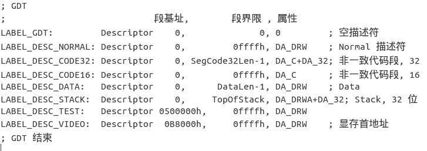

  每个Descriptor遵循如下的定义形式：

  | ; usage: Descriptor Base, Limit, Attr                    |
  | -------------------------------------------------------- |
  | ;    Base: dd                                            |
  | ;    Limit: dd (low 20 bits available)                   |
  | ;    Attr: dw (lower 4 bits of higher byte are always 0) |

  然后定义了GdtLen和GdtPtr。最后设置好每一段对应的选择子。

  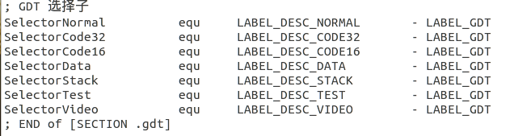

- 保护模式切换为实模式的代码阐述

  在代码/a/中，已经讨论过实模式切换为保护模式的步骤，这里我们主要关注从保护模式切换为实模式。

  切换为实模式的代码如下。

  ```
  ; 16 位代码段. 由 32 位代码段跳入, 跳出后到实模式
  [SECTION .s16code]
  ALIGN	32
  [BITS	16]
  LABEL_SEG_CODE16:
  	; 跳回实模式:
  	mov	ax, SelectorNormal
  	mov	ds, ax
  	mov	es, ax
  	mov	fs, ax
  	mov	gs, ax
  	mov	ss, ax
  
  	mov	eax, cr0
  	and	al, 11111110b
  	mov	cr0, eax
  
  LABEL_GO_BACK_TO_REAL:
  	jmp	0:LABEL_REAL_ENTRY	; 段地址会在程序开始处被设置成正确的值
  
  Code16Len	equ	$ - LABEL_SEG_CODE16
  
  ; END of [SECTION .s16code]
  ```

  SelectorNormal是一个选择子，它指向Normal描述符。在准备从保护模式切换回实模式前，需要加载一个合适的描述符选择子到有关段寄存器，使得对应段描述符告诉缓冲寄存器包含合适的段界限和属性。Normal描述符就是为了实现这一点。然后将cr0的PE位置为0，最终跳转到REAL_ENTRY段。注意，表面上是jmp 0:LABEL_REAL_ENTRY，但是在程序前面已经对这条指令进行了修改：

  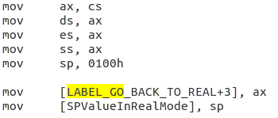

  所以实际上，这条指令在执行时变成了jmp cs_real_mode:LABEL_REAL_ENTRY。这样就能够正确跳转到目标位置。

  LABEL_REAL_ENTRY段的代码如下。主要步骤是：完成关A20，开中断操作，这些与之前从实模式跳转到保护模式的操作是互逆的。最终调用21h中断，返回DOS模式。

  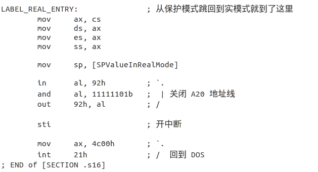

- 程序运行

  对asm文件编译，并拷贝到磁盘中。在DOS模式中运行该程序。结果如下图：

  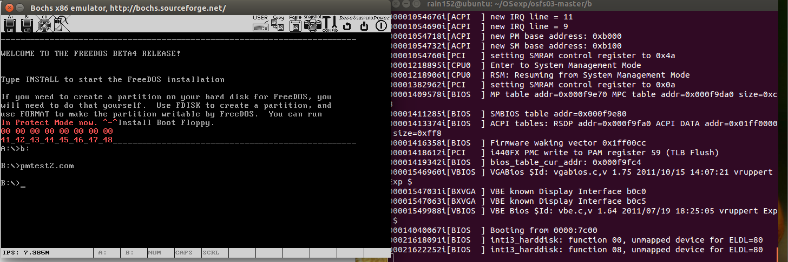

  程序运行正确，最终程序运行完毕后，又回到了实模式下的DOS。

#### 三、实验过程分析
### 代码/c/：LDT的切换

阅读代码/c/，观察与代码/b/的区别。

- GDT与LDT结构分析
  
  与代码/b/中不同的是，代码/c/中的GDT新增了一个指向LDT的描述符：
  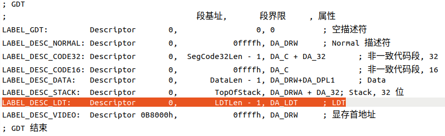


  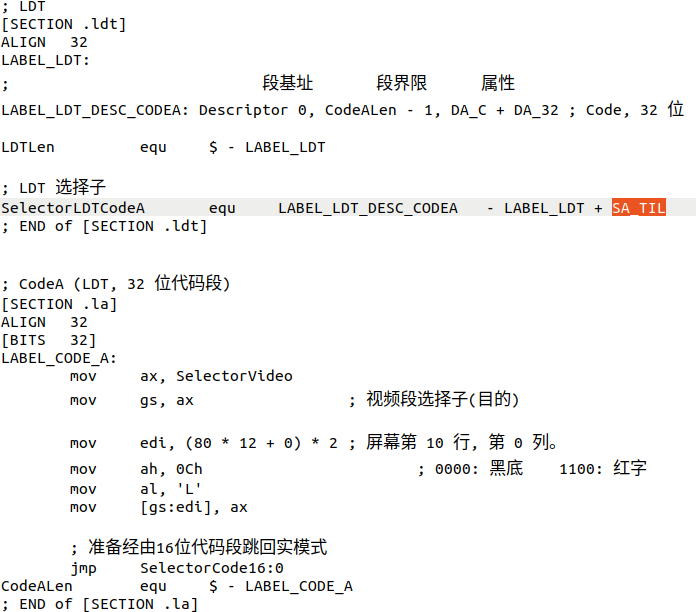
  观察发现在LDT的选择子和GDT的结构类似，但是属性中多了一个SA_TIL。查阅pm.inc文件，发现SA_TIL对应的值为4，其作用为将选择子的第2位TI置1（同理还有一个SA_TIG为将TI位置0）。当这一位为1时，系统便会将这个选择子识别为LDT选择子而非GDT选择子，从而在LDT中寻找描述符。

- 程序运行

  由于代码/c/其余部分与代码/b/并无不同，直接呈现代码运行结果：

  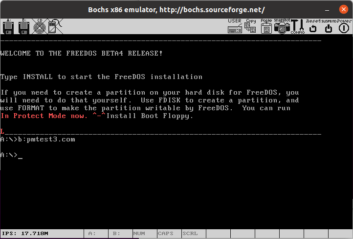

  可以看到成功打印了保护模式中的字符串和LDT中的字母"L"，结果符合预期。

## 三、实验过程分析

- 在对代码/a/进行反汇编时，发现LABEL_SEG_CODE32段的代码与源码有一定的差异。源码中32位代码段如下：

  ```
  LABEL_SEG_CODE32:
  	mov	ax, SelectorVideo
  	mov	gs, ax			; 视频段选择子(目的)
  
  	mov	edi, (80 * 11 + 79) * 2	; 屏幕第 11 行, 第 79 列。
  	mov	ah, 0Ch			; 0000: 黑底    1100: 红字
  	mov	al, 'P'
  	mov	[gs:edi], ax
  
  	; 到此停止
  	jmp	$
  ```

  反汇编后：

  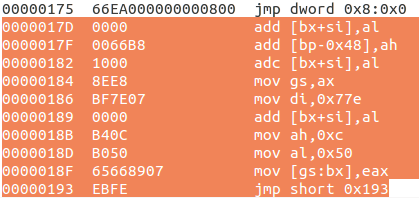

  我们联想到是反汇编默认采用的是16位反汇编。于是修改ndisasm的参数，令其以32位进行反汇编。结果如下：

  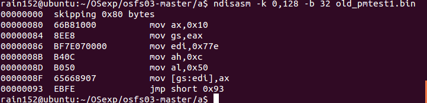

  此时能够与源码对应上。

#### 四、实验结果总结
## 四、实验结果总结

#### 五、个人贡献与体会
## 五、个人贡献与体会

#### 六、教师评价
## 六、教师评价

<table>
    <tr>
        <td colspan="3"> 教师评语 </td>
    </tr>
    <tr>
        <td colspan="3"> </br></br></br> </td>
    </tr>
    <tr align="center">
        <td colspan="3"> 教师评分</td>
    </tr>
	<tr align="center">
        <td>姓名</td>
        <td>学号</td>
        <td>分数</td>
    </tr>
    <tr align="center">
        <td>李心杨</td>
        <td>2020302181022</td>
        <td></td>
    </tr>
    <tr align="center">
        <td>王宇骥</td>
        <td>2020302181008</td>
        <td></td>
    </tr>
    <tr align="center">
        <td>林锟扬</td>
        <td>2020302181032</td>
        <td></td>
    </tr>
    <tr align="center">
        <td>郑炳捷</td>
        <td>2020302181024</td>
        <td></td>
    </tr>
	<tr>
        <td colspan="3">教师签名 </br> </br> </td>
	</tr>

