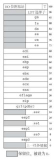
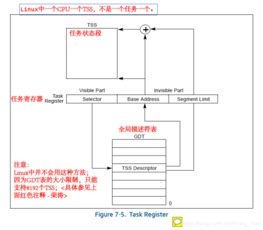
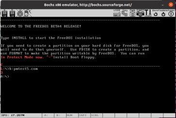
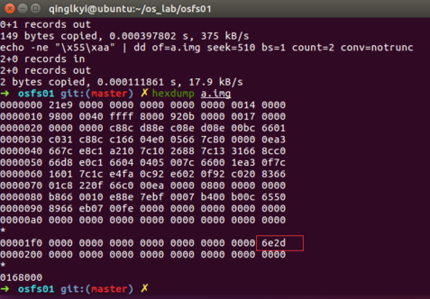

# <center>武汉大学国家网络安全学院教学实验报告</center>

|   课程名称   |  操作系统设计与实践  |   实验日期   | 2022.9.24 |
| :----------: | :------------------: | :----------: | :-------: |
| **实验名称** | **保护模式工作机理** | **实验周次** | **第2周** |
|   **姓名**   |       **学号**       |   **专业**   | **班级**  |
|    李心杨    |     202030281022     |   信息安全   |     2     |
|    王宇骥    |    2020302181008     |   信息安全   |     2     |
|    林锟扬    |    2020302181032     |   信息安全   |     2     |
|    郑炳捷    |    2020302181024     |   信息安全   |     2     |

## 一、实验目的及实验内容

### 实验目的

1. 理解x86架构下的段式内存管理。
2. 掌握实模式和保护模式下段式寻址的组织方式、关键数据结构、代码组织方式。
3. 掌握实模式与保护模式的切换。
4. 掌握特权级的概念，以及不同特权之间的转移。
5. 了解调用门、任务门的基本概念。

### 实验内容

1. 认真阅读章节资料，掌握什么是保护模式，弄清关键数据结构：GDT、descriptor、selector、GDTR及其之间关系，阅读pm.inc文件中数据结构以及含义，写出对宏Descriptor的分析。
2. 调试代码，/a/ 掌握从实模式到保护模式的基本方法，画出代码流程图，如果代码/a/中，第71行有dword前缀和没有前缀，编译出来的代码有区别么，为什么，请调试截图。
3. 调试代码，/b/，掌握GDT的构造与切换，从保护模式切换回实模式方法。
4. 调试代码，/c/，掌握LDT切换。
5. 调试代码，/d/掌握一致代码段、非一致代码段、数据段的权限访问规则，掌握CPL、DPL、RPL之间关系，以及段间切换的基本方法。
6. 调试代码，/e/掌握利用调用门进行特权级变换的转移的基本方法。

## 二、实验环境及实验步骤

### 实验环境

Ubuntu 14.04；bochs 2.7 .

### 概念分析

- **保护模式**：相比于实模式，保护模式能够支持多任务，支持优先级，并且拥有更强大的寻址能力。

  - GDT/LDT：由多个描述符(Descriptor)组成，提供段式存储机制。
  - Descriptor：每一个Descriptor定义一个段，其结构如下：
  
    
  
  ​ 段基址：共32位，存放在不连续的四个字节中，用于寻址。
  
  ​ 段界限：共20位，表示的是段边界的扩展最值。
  
  ​ 其余是相关属性位，用这些额外的属性来提高安全性。
  
  - Selector：给出描述符在GDT/LDT的索引号、GDT/LDT标志TI(Table Indicator)以及特权级RPL，当TI=0时表示段描述符在GDT中，当TI=1时表示段描述符在LDT中。
  
    
  
  - GDTR寄存器：保存GDT的起始地址和界限。
  
     

  - LDTR寄存器：由一个可见的16位选择子和不可见的存着描述符的基址和限长的由CPU维护的高速缓冲（会随时变化）组成。
  
- GDT寻址过程中的各个数据结构的**关系**：
  
      ① 先从GDTR寄存器中获得GDT基址。
      ② 在GDT中根据Selector确定Descriptor。
      ③ Descriptor给出了段的基址，再根据程序中给出的偏移地址得到最终的线性地址。 
      ④ 访存。

  

- LDT寻址过程中的各个数据结构的**关系**：
  
      ① 先从GDTR寄存器中获得GDT基址。
      ② 从LDTR寄存器中获取LDT的索引，并在GDT中找到LDT的描述符从而得到LDT段地址。
      ③ 从选择子中得到的描述符索引找到目标段的描述符，然后得到最终的线性地址。
      ④ 访存。
  
  

- GDT与LDT访存方式并没有本质上的区别，只是通过LDT访存要现在GDT中查找该LDT的位置，可以它们之间的关系理解为GDT是“一级描述符表”，LDT是“二级描述符表”。

  

- 调用门的结构

  调用门的结构如下图所示，如果选择子指向的描述符的DPL小于当前CPL则会发生提权，高32位中的低5位是调用调用门需要的参数数目。调用门的高16位和低16位为新的EIP。

  

- 使用call指令调用的不同情况

  - 短调用：call 立即数/寄存器/地址，调用后只有ESP与EIP发生变化（原EIP被压栈）。

    

  - 长调用：call cs:eip，CS指向调用门的选择子。
  
    - 不提权：旧的CS与EIP被压栈。

      

    - 提权：与不提权相比，栈段也会发生改变，具体过程将在代码/e/部分展开。

      

### 代码/a/：从实模式到保护模式

- 代码流程图

  

- 运行源码程序

  这里我们采用DOS执行COM文件的方法来运行程序。

  - 按照参考书教程，准备freedos.img和pm.img，并修改bochsrc。

  - 编译pmtest1.asm，并将pmtest1.com复制到虚拟软盘pm.img上。

    ```bash
    nasm pmtest1.asm -o pmtest1.com
    sudo mount -o loop pm.img /mnt/floppy
    sudo cp pmtest1.com /mnt/floppy
    sudo umount /mnt/floppy
    ```

  - 在FreeDos中运行程序。

    

  ​可以看到在bochs窗口右侧中出现红色的P，说明程序正确运行。

- 关键步骤解释

  - 加载GDTR：前文中已经给出了GDTR的结构，高4字节是GDT基地址，低2字节是GDT的界限。为了加载GDTR，需要首先设置好这6字节的内容。然后利用lgdt指令完成加载即可。

    相关代码如下。

  ```x86asm
  ; 为加载 GDTR 作准备
  xor eax, eax
  mov ax, ds
  shl eax, 4
  add eax, LABEL_GDT          ; eax <- gdt 基地址
  mov dword [GdtPtr + 2], eax ; [GdtPtr + 2] <- gdt 基地址
  
  ; 加载 GDTR
  lgdt [GdtPtr]
  ```

  - 关中断&打开地址线A20

    保护模式和实模式的中断处理机制不同，所以在切换时需要进行关中断操作以避免引起错误。另外，保护模式有更强的访问内存的能力，这要求将A20打开以访问全部的内存。

    - 打开A20地址线的原因：在8086和8088中，16位段地址+16位偏移地址能够表示的最大地址为FFFF:FFFF即0x10FFEF，但由于20根地址线最大只能表示0xFFFFF，所以采用了一种被称为wrap-around的技术来处理：当表示的地址大于0xFFFFF时，对其进行求模运算，使其从0重新开始，例如FFFF:0010实际表示的地址为0x0。但是80286的地址总线为24根（它仍然是16位），可以访问0x100000及以上的地址，Intel为了兼容8086和8088的特性，将这第21根地址线A20设为可被软件控制的，当A20关闭时，80286保留上述求模运算（地址第20位永远为0），开启时则可以访问0x100000及以上的地址（可以改地址第20位的值为1），这根地址线的开关也在以后的更新换代中被保留了下来。在本实验中，打开A20可以保证保护模式下内存地址连续。
  
    相关代码如下。

    ```x86asm
    ; 关中断
    cli
    
    ; 打开地址线A20
    in  al, 92h
    or  al, 00000010b
    out 92h, al
    ```

  - 切换到保护模式

    cr0寄存器的第0位是PE位，将该位置为1，CPU就能够运行于保护模式了。

    相关代码如下。

    ```x86asm
    ; 准备切换到保护模式
    mov eax, cr0
    or  eax, 1
    mov cr0, eax
    ```

- 程序修改

  将源代码中jmp dword SelectorCode32:0一句中的dword删除，重新编译并运行。结果发现程序仍然能够正常运行，窗口中仍然能够显示p。

  

  对源程序和修改程序的对应二进制文件进行反汇编，对比如下。

  ```diff
  - 00007C75  66EA000000000800  jmp dword 0x8:0x0
  - 00007C7D  0000              add [bx+si],al
  - 00007C7F  0066B8            add [bp-0x48],ah
  - 00007C82  1000              adc [bx+si],al
  - 00007C84  8EE8              mov gs,ax
  - 00007C86  BF7E07            mov di,0x77e
  - 00007C89  0000              add [bx+si],al
  - 00007C8B  B40C              mov ah,0xc
  - 00007C8D  B050              mov al,0x50
  - 00007C8F  65668907          mov [gs:bx],eax
  - 00007C93  EBFE              jmp short 0x7c93
  + 00007C75  EA00000800        jmp 0x8:0x0
  + 00007C7A  0000              add [bx+si],al
  + 00007C7C  66B810008EE8      mov eax,0xe88e0010
  + 00007C82  BF7E07            mov di,0x77e
  + 00007C85  0000              add [bx+si],al
  + 00007C87  B40C              mov ah,0xc
  + 00007C89  B050              mov al,0x50
  + 00007C8B  65668907          mov [gs:bx],eax
  + 00007C8F  EBFE              jmp short 0x7c8f
  ```

​不加dword时，地址被解释为16位，即word。在该程序中，16位仍然能够完成正确的跳转。但是这个是不严谨的，在其他情形下，当目标跳转范围较大时，只有dword才能实现正确跳转。

### 代码/b/：GDT的构造与切换，从保护模式切换为实模式

阅读代码/b/，观察GDT的结构与以及保护模式切换为实模式的方法。

- GDT结构分析

  SECTION.gdt中存放GDT的整个结构。首先是对各个Descriptor的定义。

  ```x86asm
  ; GDT
  ;                            段基址,          段界限 , 属性
  LABEL_GDT:         Descriptor    0,                0, 0             ; 空描述符
  LABEL_DESC_NORMAL: Descriptor    0,           0ffffh, DA_DRW        ; Normal 描述符
  LABEL_DESC_CODE32: Descriptor    0,   SegCode32Len-1, DA_C+DA_32    ; 非一致代码段, 32
  LABEL_DESC_CODE16: Descriptor    0,           0ffffh, DA_C          ; 非一致代码段, 16
  LABEL_DESC_DATA:   Descriptor    0,        DataLen-1, DA_DRW        ; Data
  LABEL_DESC_STACK:  Descriptor    0,       TopOfStack, DA_DRWA+DA_32 ; Stack, 32 位
  LABEL_DESC_TEST:   Descriptor 0500000h,       0ffffh, DA_DRW
  LABEL_DESC_VIDEO:  Descriptor  0B8000h,       0ffffh, DA_DRW        ; 显存首地址
  ; GDT 结束
  ```

  每个Descriptor遵循如下的定义形式：

  | ; usage: Descriptor Base, Limit, Attr                    |
  | -------------------------------------------------------- |
  | ;    Base: dd                                            |
  | ;    Limit: dd (low 20 bits available)                   |
  | ;    Attr: dw (lower 4 bits of higher byte are always 0) |

  然后定义了GdtLen和GdtPtr。最后设置好每一段对应的选择子。

  ```x86asm
  ; GDT 选择子
  SelectorNormal    equ LABEL_DESC_NORMAL - LABEL_GDT
  SelectorCode32    equ LABEL_DESC_CODE32 - LABEL_GDT
  SelectorCode16    equ LABEL_DESC_CODE16 - LABEL_GDT
  SelectorData      equ LABEL_DESC_DATA   - LABEL_GDT
  SelectorStack     equ LABEL_DESC_STACK  - LABEL_GDT
  SelectorTest      equ LABEL_DESC_TEST   - LABEL_GDT
  SelectorVideo     equ LABEL_DESC_VIDEO  - LABEL_GDT
  ;
  ```

- 保护模式切换为实模式的代码阐述

  在代码/a/中，已经讨论过实模式切换为保护模式的步骤，这里我们主要关注从保护模式切换为实模式。

  切换为实模式的代码如下。

  ```x86asm
  ; 16 位代码段. 由 32 位代码段跳入, 跳出后到实模式
  [SECTION .s16code]
  ALIGN 32
  [BITS 16]
  LABEL SEG_CODE16:
    ; 跳回实模式:
    mov ax, SelectorNormal
    mov ds, ax
    mov es, ax
    mov fs, ax
    mov gs, ax
    mov ss, ax
  
    mov eax, cr0
    and al, 11111110b
    mov cr0, eax
  
  LABEL_GO_BACK_TO_REAL:
    jmp 0:LABEL_REAL_ENTRY  ; 段地址会在程序开始处被设置成正确的值
  
  Code16Len equ $ - LABEL_SEG_CODE16
  
  ; END of [SECTION .s16code]
  ```

  SelectorNormal是一个选择子，它指向Normal描述符。在准备从保护模式切换回实模式前，需要加载一个合适的描述符选择子到有关段寄存器，使得对应段描述符告诉缓冲寄存器包含合适的段界限和属性。Normal描述符就是为了实现这一点。然后将cr0的PE位置为0，最终跳转到REAL_ENTRY段。注意，表面上是jmp 0:LABEL_REAL_ENTRY，但是在程序前面已经对这条指令进行了修改：

  ```x86asm
  mov ax, cs
  mov ds, ax
  mov es, ax
  mov ss, ax
  mov sp, 0100h

  mov [LABEL_GO_BACK_TO_REAL+3], ax
  mov [SPValueInRealMode], sp
  ```

  所以实际上，这条指令在执行时变成了jmp cs_real_mode:LABEL_REAL_ENTRY。这样就能够正确跳转到目标位置。

  LABEL_REAL_ENTRY段的代码如下。主要步骤是：完成关A20，开中断操作，这些与之前从实模式跳转到保护模式的操作是互逆的。最终调用21h中断，返回DOS模式。

  ```x86asm
  LABEL_REAL_ENTRY:    ; 从保护模式跳回到实模式就到了这里
  mov ax, cs
  mov ds, ax
  mov es, ax
  mov ss, ax

  mov sp, [SPValueInRealMode]

  in al, 92h
  and al, 11111101b    ; 关闭 A20 地址线
  out 92h, al

  sti; 开中断

  mov ax, 4c00h
  int 21h              ; 回到 DOS
  ;
  ```

- 程序运行

  对asm文件编译，并拷贝到磁盘中。在DOS模式中运行该程序。结果如下图：

  

  程序运行正确，最终程序运行完毕后，又回到了实模式下的DOS。

### 代码/c/：LDT的切换

阅读代码/c/，观察与代码/b/的区别。

- GDT与LDT结构分析
  
  与代码/b/中不同的是，代码/c/中的GDT新增了一个指向LDT的描述符：

  ```diff
    ; GDT
    ;                                         段基址,         段界限,           属性
    LABEL_GDT:         Descriptor       0,                 0, 0               ; 空描述符
    LABEL_DESC_NORMAL: Descriptor       0,            0ffffh, DA_DRW          ; Normal 描述符
    LABEL_DESC_CODE32: Descriptor       0,  SegCode32Len - 1, DA_C + DA_32    ; 非一致代码段, 32
    LABEL_DESC_CODE16: Descriptor       0,            0ffffh, DA_C            ; 非一致代码段, 16
    LABEL_DESC_DATA:   Descriptor       0,       DataLen - 1, DA_DRW+DA_DPL1  ; Data
    LABEL_DESC_STACK:  Descriptor       0,        TopOfStack, DA_DRWA + DA_32 ; Stack, 32 位
  + LABEL_DESC_LDT:    Descriptor       0,        LDTLen - 1, DA_LDT          ; LDT
    LABEL_DESC_VIDEO:  Descriptor 0B8000h,            0ffffh, DA_DRW          ; 显存首地址
    ; GDT 结束
  ```

  同时还新增了两个section，分别为LDT和其中选择子指向的代码段：

  ```x86asm
  ; LDT
  [SECTION .ldt]
  ALIGN 32
  LABEL_LDT:
  ;                            段基址       段界限      属性
  LABEL_LDT_DESC_CODEA: Descriptor 0, CodeALen - 1, DA_C + DA_32  ; Code, 32 位

  LDTLen    equ $ - LABEL_LDT

  ; LDT 选择子
  SelectorLDTCodeA  equ LABEL_LDT_DESC_CODEA  - LABEL_LDT + SA_TIL
  ; END of [SECTION .ldt]

  ; CodeA (LDT, 32 位代码段)
  [SECTION .la]
  ALIGN 32
  [BITS 32]
  LABEL_CODE_A:
  mov ax, SelectorVideo
  mov gs, ax                  ; 视频段选择子(目的)

  mov edi, (80 * 12 + 0) * 2  ; 屏幕第 10 行, 第 0 列。
  mov ah, 0Ch                 ; 0000: 黑底    1100: 红字
  mov al, 'L'
  mov [gs:edi], ax

  ; 准备经由16位代码段跳回实模式
  jmp SelectorCode16:0
  CodeALen  equ $ - LABEL_CODE_A
  ; END of [SECTION .la]
  ```

  观察发现在LDT的选择子和GDT的结构类似，但是在LDT选择子的属性中多了一个SA_TIL。查阅pm.inc文件，发现SA_TIL对应的值为4，其作用为将选择子的第2位TI置1（同理还有一个SA_TIG为将TI位置0）。当这一位为1时，系统便会将这个选择子识别为LDT选择子而非GDT选择子，从而在LDT中寻找描述符。  

- 程序运行

  由于代码/c/其余部分中除了在进保护模式以后用lldt指令加载LDTR以外与代码/b/并无不同，直接呈现代码运行结果：

  

  可以看到成功打印了保护模式中的字符串和LDT中的字母"L"，结果符合预期。

### 代码/d/：同权限级的段间切换

- 三类段间的权限访问规则
  
  |                | 特权级低到高 | 特权级高到低 | 相同特权级之间 |
  | ---------      | ----------- | ----------- | --------- |
  | **一致代码段**  |    允许     |    不允许   |   允许     |
  | **非一致代码段** | 不允许  | 不允许 |  允许 |
  | **数据段**  |  不允许 |  允许  |  允许 |

- CPL、DPL 与 RPL
  
  - 三者功能的基本描述：

    CPL、DPL、RPL 都是段访问机制中的特权级表示位。它的值是 0 ~ 3，描述了特权级的高低。（0 为最高，3 为最低）

    其中，**CPL** (Current Privilege Level) 描述当前执行程序或者任务的特权级。存储在 CS 和 SS 的第 0 位和第 1 位。

    **DPL** (Descriptor Privilege Level) 描述段或者门的特权级。存储在描述符的 DPL 字段中。

    **RPL** (Request Privilege Level) 描述选择子的权限级。存储在选择子的第 0 位和第 1 位。

  - 在权限访问规则中的作用：

    我们不难想到，前面所谓的“特权级由低到高”等说法，体现在这里，就是对 CPL 和 DPL 的值进行比较。

    通常情况下，CPL 会随着当前代码段权限的变化而变化。特殊的，当程序转移到一致代码段时，CPL 保持不变。

    DPL 则是对试图访问段的程序的 CPL 或 RPL 进行了限制。这一限制在不同类型的段下有不同的体现：

    | 段类型 | 限制要求 |
    | --- | --- |
    | 数据段、调用门 | $CPL \leq DPL$ |
    | 非一致代码段（不使用调用门） | $CPL = DPL$ |
    | 一致代码段与门调用的非一致代码段 | $CPL \geq DPL$ |

    而 RPL 则是在考虑了调用机制后对这一规则的补充。

    > 具体的，当程序从低特权级的代码段转移到高特权级的非一致代码段（比如通过系统调用）时，CPL 会改变，当前权限级会提高。  
    > 如果没有 RPL，应用程序就可以借助系统调用的高权限，来非法地访问自己权限不足以访问的段。  
    > 为了避免这一现象，操作系统会在被调用过程接收到从调用过程传来的选择子时，将调用者的 CPL 存储在这个选择子的 RPL 中。综合 RPL 和 CPL，来决定是否有访问段的权限。

- 代码阅读
  
  本节的代码 pmtest4.asm，给出了同权限级的段间转移示例。相比前面，它重要的部分如下：

  首先，是门描述符和选择子的定义。不难发现，它的定义方式与段描述符的方法类似。通过 pm.inc 中的宏 Gate，可以将门的四个部分：目标选择子、偏移、DCount、属性方便地格式化为规定的形式。
  
  代码段中的 LABEL_DESC_CODE_DEST，则是被调用段的描述符。DA_C 和 DA_32 两个参数，表示它是个非一致的 32 位代码段。

  ```x86asm
  [SECTION .gdt]
  ...
  LABEL_DESC_CODE_DEST: Descriptor              0,  SegCodeDestLen-1, DA_C+DA_32; 非一致代码段,32
  ...
  LABEL_CALL_GATE_TEST: Gate SelectorCodeDest,  0,  0,                DA_386CGate+DA_DPL0
  ...
  SelectorCodeDest      equ LABEL_DESC_CODE_DEST  - LABEL_GDT
  ...
  SelectorCallGateTest  equ LABEL_CALL_GATE_TEST  - LABEL_GDT
  ...
  ```

  接下来是被调用代码段的描述符初始化。类似与前面其它的段描述符初始化。

  ```x86asm
  [SECTION .s16]
  ...
  ; 初始化测试调用门的代码段描述符
  xor eax, eax
  mov ax, cs
  shl eax, 4
  add eax, LABEL_SEG_CODE_DEST
  mov word [LABEL_DESC_CODE_DEST + 2], ax
  shr eax, 16
  mov byte [LABEL_DESC_CODE_DEST + 4], al
  mov byte [LABEL_DESC_CODE_DEST + 7], ah
  ...
  ```

  通过 call 指令，我们可以对门进行调用。由于此处都是 ring 0，满足非一致代码段的权限访问要求，因此直接访问代码段和调用门都是可行的。

  ```x86asm
  [SECTION .s32]; 32 位代码段. 由实模式跳入.
  ...
  ; 测试调用门（无特权级变换），将打印字母 'C'
  call  SelectorCallGateTest:0
  ;call SelectorCodeDest:0
  ...

  [SECTION .sdest]; 调用门目标段
  [BITS 32]
  LABEL_SEG_CODE_DEST:
    ;jmp  $
    mov ax, SelectorVideo
    mov gs, ax                  ; 视频段选择子(目的)
    mov edi, (80 * 12 + 0) * 2  ; 屏幕第 12 行, 第 0 列。
    mov ah, 0Ch                 ; 0000: 黑底    1100: 红字
    mov al, 'C'
    mov [gs:edi], ax
    retf
  SegCodeDestLen  equ $ - LABEL_SEG_CODE_DEST
  ; END of [SECTION .sdest]
  ...
  ```

  该代码段会在屏幕第 12 行第 0 列显示一个字母 C。它的运行结果如下，符合我们的预期：

  

  后续代码与代码/c/类似，通过LDT打印一个字符L，最后结果符合预期。

### 代码/e/：利用调用门进行特权级变换的转移

阅读代码/e/，观察其与代码/d/的区别
  
- 新增的任务状态段tss和ring3以及对它们的定义和初始化
  
  ```diff
  ；GDT描述符
  + LABEL_DESC_CODE_RING3: Descriptor 0, SegCodeRing3Len-1, DA_C+DA_32+DA_DPL3
  + LABEL_DESC_TSS:        Descriptor 0,          TSSLen-1, DA_386TSS           ;TSS

  ；GDT选择子
  + SelectorCodeRing3 equ LABEL_DESC_CODE_RING3 - LABEL_GDT + SA_RPL3
  + SelectorTSS       equ LABEL_DESC_TSS        - LABEL_GDT
  ```
  
  ```x86asm
  ; 堆栈段ring3
  [SECTION .s3]
  ALIGN 32
  [BITS 32]
  LABEL_STACK3:
  times 512 db 0
  TopOfStack3 equ $ - LABEL_STACK3 - 1
  ; END of [SECTION .s3]

  ; 初始化堆栈段描述符(ring3)
  xor eax, eax
  mov ax, ds
  shl eax, 4
  add eax, LABEL_STACK3
  mov word [LABEL_DESC_STACK3 + 2], ax
  shr eax, 16
  mov byte [LABEL_DESC_STACK3 + 4], al
  mov byte [LABEL_DESC_STACK3 + 7], ah

  ; 初始化Ring3描述符
  xor eax, eax
  mov ax, ds
  shl eax, 4
  add eax, LABEL_CODE_RING3
  mov word [LABEL_DESC_CODE_RING3 + 2], ax
  shr eax, 16
  mov byte [LABEL_DESC_CODE_RING3 + 4], al
  mov byte [LABEL_DESC_CODE_RING3 + 7], ah

  ; 初始化 TSS 描述符
  xor eax, eax
  mov ax, ds
  shl eax, 4
  add eax, LABEL_TSS
  mov word [LABEL_DESC_TSS + 2], ax
  shr eax, 16
  mov byte [LABEL_DESC_TSS + 4], al
  mov byte [LABEL_DESC_TSS + 7], ah

  ; TSS 
  [SECTION .tss]
  ALIGN 32
  [BITS 32]
  LABEL_TSS:
      DD  0                 ; Back
      DD  TopOfStack        ; 0 级堆栈
      DD  SelectorStack     ; 
      DD  0                 ; 1 级堆栈
      DD  0                 ; 
      DD  0                 ; 2 级堆栈
      DD  0                 ; 
      DD  0                 ; CR3
      DD  0                 ; EIP
      DD  0                 ; EFLAGS
      DD  0                 ; EAX
      DD  0                 ; ECX
      DD  0                 ; EDX
      DD  0                 ; EBX
      DD  0                 ; ESP
      DD  0                 ; EBP
      DD  0                 ; ESI
      DD  0                 ; EDI
      DD  0                 ; ES
      DD  0                 ; CS
      DD  0                 ; SS
      DD  0                 ; DS
      DD  0                 ; FS
      DD  0                 ; GS
      DD  0                 ; LDT
      DW  0                 ; 调试陷阱标志
      DW  $ - LABEL_TSS + 2 ; I/O位图基址
      DB  0ffh              ; I/O位图结束标志
  TSSLen  equ $ - LABEL_TSS
  ; TSS 
  ```

  

- ring3下的提权调用流程：跨特权级进行调用不能共享堆栈，防止不同特权级共用数据产生安全风险。

      ①根据目标代码段的DPL（新的CPL）从TSS中提取SS与ESP。
      ②检验SS、ESP、TSS界限和SS描述符，发生错误时产生异常。
      ③暂时保存当前SS与ESP，加载新的SS与ESP，然后将刚才临时保存的SS与ESP压入新栈。
      ④将数据从调用者（旧）的堆栈中复制到被调用者（新）的堆栈中，复制的参数数目由调用门的Param-Count决定。
      ⑤将CS与EIP压栈并加载调用门中新的CS与EIP。
      ⑥调用完成，执行被调用过程。

- 如何找到TSS以及TSS的用途

  CPU通过保存着16位选择子、32位基址、16位限长和当前任务的TSS属性的TR寄存器来找到TSS。通过上面的代码可以看到TSS中保存了ring0/1/2的栈段选择子和栈顶指针，以及大量其他寄存器。在本代码的提权调用中，SS0与ESP0被取出成为了新的SS与ESP，同时TSS还有一个功能就是在调用（或跳转）中将其他寄存器保存。综上：在call/jmp中，CPU会将TSS结构中有的所有寄存器都写入当前TR指向的TSS中，然后将新TSS的选择子指向的描述符加载的TR寄存器中，并将这个TSS中的寄存器值都提出来。

  TR寄存器结构和利用TSS调用或跳转流程如下图：

  

  

- 程序运行

  打印出了字符“3”说明成功进入ring3，打印出了“C”说明在ring3下的提权调用成功了，重新回到ring0，实验结果符合预期。

  

## 三、实验过程分析与故障记录

- 在对代码/a/进行反汇编时，发现LABEL_SEG_CODE32段的代码与源码有一定的差异。源码中32位代码段如下：

  ```x86asm
  LABEL_SEG_CODE32:
    mov ax, SelectorVideo
    mov gs, ax                  ; 视频段选择子(目的)
  
    mov edi, (80 * 11 + 79) * 2 ; 屏幕第 11 行, 第 79 列。
    mov ah, 0Ch                 ; 0000: 黑底    1100: 红字
    mov al, 'P'
    mov [gs:edi], ax
  
    ; 到此停止
    jmp $
  ```

  反汇编后：

  

  在 bochs 中进行调试对比，我们不难发现，反汇编程序把对齐用的三个字节的 0 当成了指令。

  

  我们联想到是反汇编默认采用的是16位反汇编。于是修改ndisasm的参数，令其以32位进行反汇编。结果如下：

  

  此时能够与源码对应上。

- 在尝试将 pmtest1.asm 作为引导程序运行时出现故障：

  

  原因是 pmtest1.asm 与实验一的代码不同，它不包含填充到 510 字节和写入 0xaa55 的部分。而且由于它有很多的 section，直接使用 `times 510-($-$$)` 是不行的，因为 \$\$ 针对的是当前段。

  因此，我们需要使用指令来写入 0xaa55。

  ```bash
  echo -ne "\x55\xaa" | dd of=a.img seek=510 bs=1 count=2 conv=notrunc
  ```

  通过 `-e`，来让 echo 输出特殊的转义字符到标准输出中，并作为 dd 的标准输入写入 a.img 的特定位置。

  这样做直接在 bash 或 zsh 下运行时是可行的。但当我们将其写入 makefile 文件中后，却发现无法正常写入：

  

  它写入了莫名其妙的 0x6e2d。

  经过查表发现，0x6e2d 其实是字符串 "-n" 的 16 进制表示。通过查阅资料得知，make 默认使用 sh 来执行指令，而在高版本 ubuntu 中，为了加快脚本执行的速度，/bin/sh 默认使用的是 dash 而不是 bash。dash 并不支持 -ne 这样的参数。

  在 Makefile 中加上一行声明 shell 即可。

  ```makefile
  SHELL=/bin/bash
  ```

## 四、实验结果总结

### 思考题 1：
> GDT、Descriptor、Selector、GDTR结构，及其含义是什么？他们的关联关系如何？pm.inc所定义的宏怎么使用？

  在前文实验步骤的概念分析中，已经对 GDT、Descriptor、Selector、GDTR 结构、含义和彼此的关系进行了分析，此处不再重复。

  关于宏的使用问题，前面已经分析了足够多的例子（如 Descriptor，Gate 等）。

### 思考题 2：
> 从实模式到保护模式，关键步骤有哪些？为什么要关中断？为什么要打开A20地址线？从保护模式切换回实模式，又需要哪些步骤？

  上述问题同样已在实验步骤的分析中做了详细的解读。此处不再赘述。

### 思考题 3：
> 解释不同权限代码的切换原理，call, jmp,retf使用场景如何，能够互换吗？

  三条指令的近转移形式(retf的近转移形式为ret)只在当前代码段中执行程序控制转移，因此不会执行特权级检查。在远转移形式中会把控制转移到另一个代码段中，因此处理器会执行特权级检查。

  jmp指令仅仅执行跳转，不会保存当前指令的地址，不考虑调用返回；在段间跳转时，call指令回保存当前的EIP和CS，供后续调用返回使用，当涉及特权级变化时，需要准备好TSS；retf从当前堆栈中取得EIP和CS，从而完成调用返回，当涉及特权级变化，还需要从堆栈中取出ESP和SS，恢复调用者堆栈。

### 动手改 1：
> 自定义添加1个GDT代码段、1个LDT代码段，GDT段内要对一个内存数据结构写入一段字符串，然后LDT段内代码段功能为读取并打印该GDT的内容。

### 动手改 2：
> 自定义2个GDT代码段A、B，分属于不同特权级，功能自定义，要求实现A-->B的跳转，以及B-->A的跳转。

### 改进意见：

  - 我们查阅了官方文档。认为可以将繁琐的描述符初始化定义成宏，使代码更简洁、可读。同时，Magic Break 的语句也可写成宏，方便调试的进行。

    ```x86asm
    ; Usage: InitSeg label_gdt, label_seg
    ; Initilize base address of a segment descriptor in the GDT
    ;
    ; label_gdt: Label name of Descriptor in gdt
    ; label_seg: Label at the start of the segment
    %macro InitSeg 2
        xor eax, eax
        mov ax, cs
        shl eax, 4
        add eax, %2
        mov word [%1 + 2], ax
        shr eax, 16
        mov byte [%1 + 4], al
        mov byte [%1 + 7], ah
    %endmacro

    ; Usage: DebugBreak
    ; Set magic breakpoint for bochs
    %macro DebugBreak 0
        %ifdef DEBUG
        xchg bx, bx
        %endif
    %endmacro
    ```

  - 随书源码在定义描述符的属性时，使用了粗暴的将值加起来的写法。

    像这样的：

    ```x86asm
    LABEL_DESC_STACK3:     Descriptor 0,       TopOfStack3, DA_DRWA + DA_32 + DA_DPL3
    ```

    虽然属性的表示位确实是彼此不同的，但我们认为这样的写法不够严谨。更准确合适的写法应该是：

    ```x86asm
    LABEL_DESC_STACK3:     Descriptor 0,       TopOfStack3, DA_DRWA | DA_32 | DA_DPL3
    ```

  - `mount -o loop ...` 指令使用了 loop device 这一伪设备，因此每次都需要 sudo 权限。

    我们可以使用工具包 libguestfs-tools，这样就可以使用不需要 sudo 权限的 guestmount 来挂载虚拟软盘了。

    这样在调试和 make 的时候就可以少输入几次密码了。

## 五、实验分工与心得体会

通过本次实验，我们对保护模式有更加深入全面的理解，包括保护模式的相关数据结构及实现方式、实模式和保护模式的切换、保护模式下的特权级机制等内容。在阅读代码时，需要关注实模式和保护模式的寻址方式，并且在编写代码时处理好这些细节。当程序变得复杂时，要运用好GDT/LDT的段式管理，对每一个进程设置好对应的LDT。另外，在动手改环节，也对不同段的权限进行了一定的探究，理解了保护模式下如何运用权限机制来实现“保护”，并且掌握特权级变换的方式。

本次实验分工大致如下：李心杨；王宇骥主要调试代码/a/和/b/，对模式切换和GDT构造的代码原理进行总结；林锟扬；郑炳捷。


## 六、教师评价

<table>
    <tr>
        <td colspan="3"> 教师评语 </td>
    </tr>
    <tr>
        <td colspan="3"> </br></br></br> </td>
    </tr>
    <tr align="center">
        <td colspan="3"> 教师评分</td>
    </tr>
	<tr align="center">
        <td>姓名</td>
        <td>学号</td>
        <td>分数</td>
    </tr>
    <tr align="center">
        <td>李心杨</td>
        <td>2020302181022</td>
        <td></td>
    </tr>
    <tr align="center">
        <td>王宇骥</td>
        <td>2020302181008</td>
        <td></td>
    </tr>
    <tr align="center">
        <td>林锟扬</td>
        <td>2020302181032</td>
        <td></td>
    </tr>
    <tr align="center">
        <td>郑炳捷</td>
        <td>2020302181024</td>
        <td></td>
    </tr>
	<tr>
        <td colspan="3">教师签名 </br> </br> </td>
	</tr>

