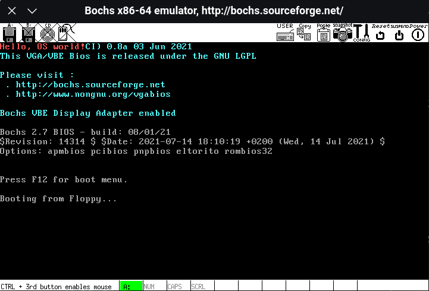
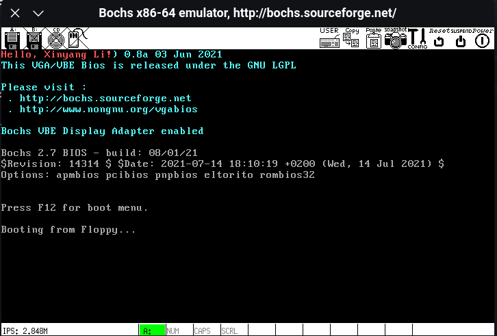
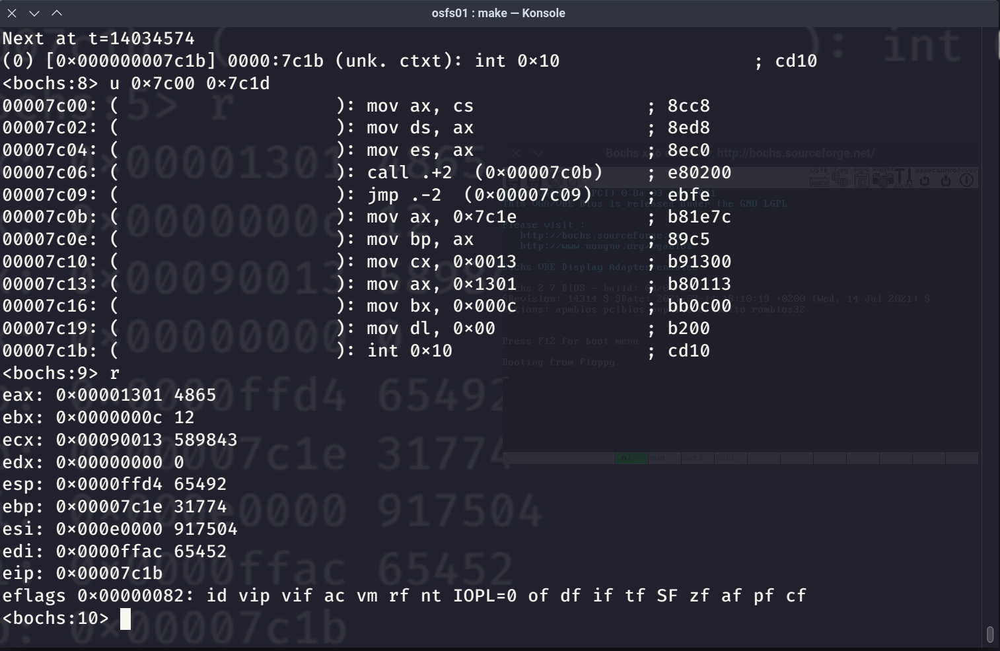
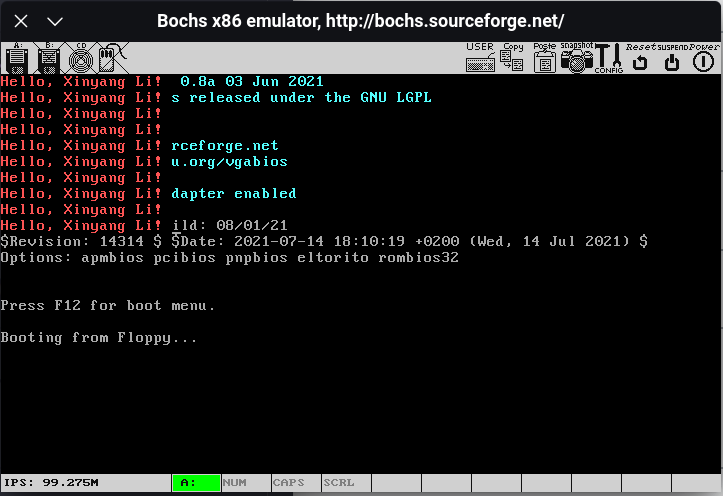

# 武汉大学国家网络安全学院教学实验报告

|          |                |          |            |
|----------|----------------|----------|------------|
| 课程名称 | 操作系统与实践 | 实验日期 | 2022-09-12 |
| 实验名称 | 实验环境搭建   | 实验周次 | 1          |
| 姓名     | 学号           | 专业     | 班级       |
| 李心杨   | 2020302181022  | 信息安全 | 1          |

实验中用到的代码和截图全部放在了 [GitHub](https://github.com/xinyangli/orange-os/tree/master/examples/osfs01) 上。

## 实验目的及实验内容

> 本次实验涉及并要求掌握的知识；实验内容；必要的原理分析

### 实验目的

搭建基本实验环境，熟悉基本开发及调试工具

### 实验内容

1. 配置 Linux 运行环境
2. 编译安装 Bochs
3. 阅读、编译 boot.asm，并反汇编阅读
4. 使用 bximage 创建软盘，并将烧录 boot.bin
5. 修改 bochsrc，使用 Bochs 运行系统
6. 修改代码，并利用 Bochs 的调试功能

### 原理分析

Bochs 是一个 X86 系统的软件模拟器，可以模拟大量外设，并且附带了 BIOS 和 VGABIOS。本次实验所创建的 a.img 为 MBR 格式，通过将其设置为启动盘，BIOS 可以加载这张虚拟软盘中的内容并正确跳转到代码段，运行打印字符串的代码。

## 实验环境及实验步骤

> 本次实验所使用的器件、仪器设备等的情况；具体的实验步骤

### 实验环境

|       | Version                    |
|-------|----------------------------|
| OS    | openSUSE Tumbleweed 220901 |
| bochs | 2.7                        |
| nasm  | 2.15.5                     |

### 实验环境搭建

1. 我的主机就是 Linux 系统，故我没有安装虚拟机，而是直接在主机上配置实验环境。
2. 下载 [bochs 2.7](https://sourceforge.net/projects/bochs/files/bochs/2.7/bochs-2.7.tar.gz/download) 源码
3. 执行 `./configure --with-sdl2 --enable-debugger --enable-readline`
4. 根据 configure 输出的结果，安装缺失的库文件和头文件，然后重新运行第 4 步
5. 执行 `make && make install`

### 运行 Smallest OS

1. 根据书上对应内容，编写 boot.asm
2. 使用 nasm 将 boot.asm 编译成 boot.bin
3. 使用 bximage 创建虚拟软盘文件 a.img
4. 利用 dd，将 boot.bin 的数据“烧录”到 a.img 中
5. 参考书上示例，编写 bochsrc
6. 运行 bochs，使用调试功能观察代码运行情况

## 实验过程分析

> 实验分工，详细记录实验过程中发生的故障和问题，进行故障分析，说明故障排除的过程及方法。根据具体实验，记录、整理相关的数据表格等

### 实验过程记录

我将过程中用到的所有命令写到了 Makefile 中，可以直接使用 `make` 进入 bochs 的调试界面。

```Makefile
all: .bochsrc a.img
        bochs -q

boot.bin: boot.asm
        nasm boot.asm -o boot.bin

a.img: boot.bin
        bximage -func=create -fd=1.44M -q a.img
        dd if=boot.bin of=a.img bs=512 count=1 conv=notrunc

.PHONY: clean

clean:
        rm a.img boot.bin
```

#### 1. 运行示例代码



#### 2. 修改代码，打印自己的名字

示例代码利用 `int 10h` 调用 BIOS 中断，实现字符串打印功能。根据手册，CX 表示的是字符串中字符个数，ES:BP 指向的地址是字符串的起始地址。将 "OS world" 替换为自己的名字，需要修改的正是这两个参数。

所以对 boot.bin 进行以下修改：

```diff
@@ -7,13 +7,13 @@
DispStr:
        mov ax, BootMessage
        mov bp, ax
-       mov cx, 16                     ; Length of string (CX)
+       mov cx, 18                     ; Length of string (CX)
        mov ax, 01301h
        mov bx, 000ch
        mov dl, 0
        int 10h                        ; BIOS interrupt
        ret
BootMessage:
-       db "Hello, OS world!"
+       db "Hello, Xinyang Li!"
        times 510-($-$$) db 0          ; Fill the remaining MBR
        dw 0xaa55
```

其中，第 7 行的 18 表示需要输出的字符串共有 18 个字符。修改后，重新 make，即可看到屏幕上的文字变为 "Hello, Xinyang Li!"



#### 3. 对生成的文件反汇编

使用 `objdump -b binary -D -m i8086 -M intel boot.bin` 对生成的二进制文件进行反汇编。

```asm
00000000 <.data>:
   0:   8c c8                   mov    ax,cs
   2:   8e d8                   mov    ds,ax
   4:   8e c0                   mov    es,ax
   6:   e8 02 00                call   0xb
   9:   eb fe                   jmp    0x9
   b:   b8 1e 7c                mov    ax,0x7c1e
   e:   89 c5                   mov    bp,ax
  10:   b9 13 00                mov    cx,0x13
  13:   b8 01 13                mov    ax,0x1301
  16:   bb 0c 00                mov    bx,0xc
  19:   b2 00                   mov    dl,0x0
  1b:   cd 10                   int    0x10
  1d:   c3                      ret
```

通过反汇编可以看出，文件数据是从 0 地址开始的。但是在 0xb 位置的指令使用了 0x7c1e 这个地址。说明在编译过程中，编译器认为这段代码会被加载到 0x7c00 的位置。

使用 bochs 进行调试



发现程序的确被 BIOS 加载到了 0x7c00 的位置。

#### 4. 将 jmp 修改为循环 100 次

`jmp $` 的作用是在打印字符串后无限循环，使系统一直停留在此处。

```diff
@@ -2,9 +2,13 @@
         mov ax, cs
         mov ds, ax
         mov es, ax
+        mov cx, 100
+disp:
         call DispStr
+        loop disp
         jmp $
 DispStr:
+        push cx
         mov ax, BootMessage
         mov bp, ax
         mov cx, 19                     ; Length of string (CX)
@@ -12,6 +16,7 @@ DispStr:
         mov bx, 000ch
         mov dl, 0
         int 10h                        ; BIOS interrupt
+        pop cx
         ret
 BootMessage:
         db "Hello, Xinyang Li!"
```

通过以上的修改，可以使打印字符过程被执行 100 次。其中 cx 寄存器是 loop 指令的计数寄存器，而这个寄存器在 DispStr 函数中也被使用了。所以，在进入函数时需要使用 push 指令将 cx 保存到调用栈中，在函数执行结束后，再使用 pop 指令恢复。

### 故障及解决方法记录

#### 1. 直接使用了编译好的 bochs，发现没有调试功能

解决方法：需要手动编译 bochs，在 configure 的时启用相应的 flag

#### 2. 找不到 SDL 库

解决方法：高版本的 Linux 发行版的软件源中普遍没有 SDL1，查找 bochs 的[编译手册](https://bochs.sourceforge.io/doc/docbook/user/compiling.html)，发现可以通过 --with-sdl2 来启用 sdl2 加速

#### 3. bochsrc 中 keyboard_mapping 项已经不被支持

解决方法：查阅[文档](https://bochs.sourceforge.io/doc/docbook/user/bochsrc.html)，把该项修改为

```text
keyboard: keymap=/usr/local/share/bochs/keymap/sdl2-pc-us.map
```

#### 4. bochsrc 中 BIOS 的路径不正确

根据[文档](https://bochs.sourceforge.io/doc/docbook/user/bochsrc.html)，新版本的 bochs 会默认将 BIOS 文件和 kaymap 文件安装到 /usr/local/share/bochs 路径下。所以需要修改 bochsrc 中对应的文件路径。

#### 5. 在写 boot.asm 中的 DispStr 时忘记写 `RET`

在 debug 的过程中发现计算机在打印字符后未按预期在 `jmp $` 处循环，经肉眼排查发现是忘记写 `RET`

## 实验结果总结

> 对实验结果进行分析，完成思考题目，并提出实验的改进意见

### 思考题目

#### 1. 为什么要对段寄存器进行赋值

在 16 位实模式中，采用段寄存器的方式访问内存。其中 cs 和 ds 通常都是由操作系统填充，分别代表数据段和代码段。对于内存的 load 和 store 默认会使用 ds 段。但是在本实验中没有用到 ds 段，所以对 ds 段的赋值其实是不必要的。

在 BIOS 中断打印字符时，会到 es:bp 这个位置访问字符串。在 boot.asm 中，数据被放在了代码段的后一部分，所以需要将 es 设为和 cs 相同，以便 BIOS 中断处理程序访问数据。

#### 2. 如何在该程序中调用系统中断

BIOS 在启动过程中向中断向量表中写入了一部分中断处理程序。在实验代码中，我们使用 `int 10h` 来调用 BIOS 中断，帮助我们打印字符串。此指令会触发 CPU 的软中断，CPU 在接到中断后，到中断向量表中寻找 16 号中断的处理程序。中断处理程序接受到所需的参数，完成我们需要的功能。

在实验中，我们调用中断之前，根据手册，写入了中断处理程序需要的参数(ax, bx, cx, dx, es:bp)，然后调用 `int 10h`，实现了对系统调用的中断。

### 对实验的改进

1. 书上的 bochs 版本有一些落后，如果想要使用新版本的 bochs 做实验的话，需要根据官方文档来调整 BIOS 和显示驱动所在的路径。也许可以把官方的[编译手册](https://bochs.sourceforge.io/doc/docbook/user/compiling.html)放入实验参考资料中，便于后面的同学编译。

2. 在循环中每次调用系统中断之前，修改 DH 寄存器的值，即能实现多行打印的效果。

  